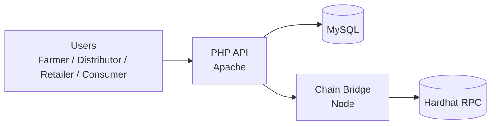

<div align="center">
  <h1>FarmLedger Backend</h1>
  <p>PHP API + MySQL + Hardhat chain bridge for tamper-evident farm-to-shelf traceability.</p>
  <p>
    
    
    
    
    
  </p>
  <p><strong>Built by Shashank Preetham Pendyala</strong></p>
</div>

---

## Overview

FarmLedger Backend powers the traceability workflow behind the FarmLedger mobile experience. It records batch creation and custody transfers in MySQL, generates QR payloads, and anchors batch hashes through a chain bridge on a local Hardhat network for tamper-evident verification.

---

## Table of Contents

- [Why It Matters](#why-it-matters)
- [Key Capabilities](#key-capabilities)
- [Core Roles](#core-roles)
- [Architecture](#architecture)
- [Repository Structure](#repository-structure)
- [Local Development](#local-development)
- [Environment Variables](#environment-variables)
- [Smart Contract](#smart-contract)
- [API Modules](#api-modules)
- [Verification Flow](#verification-flow)
- [Production Notes](#production-notes)
- [License](#license)

---

## Why It Matters

- Counterfeit produce and opaque supply chains erode trust and margins.
- FarmLedger provides a verifiable custody chain for every batch.
- QR-first verification reduces audit friction in the field.

---

## Key Capabilities

| Capability | Description |
| --- | --- |
| Role-based access | Farmer, Distributor, Retailer, Consumer flows supported. |
| QR traceability | Generate and verify batch QR payloads quickly. |
| Tamper-evident hash | Batch hashes anchored via chain bridge. |
| Custody timeline | Each handoff recorded with timestamps and metadata. |
| Dockerized stack | One-command local development environment. |

---

## Core Roles

- **Farmer**: creates batches, generates QR, initiates transfers.
- **Distributor**: verifies batches, updates transport/location, passes custody.
- **Retailer**: confirms receipt, manages inventory, marks sales.
- **Consumer**: verifies provenance and authenticity with QR scan.

---

## Architecture



---

## Repository Structure

- `api/` PHP API endpoints, auth, QR, and verification
- `farmledger_chain_bridge/` Hardhat + bridge server + contract
- `docker/` Dockerfiles
- `docker-compose.yml` Full local stack

---

## Local Development

### 1. Configure environment

```bash
cp .env.example .env
```

### 2. Start the stack

```bash
docker compose up --build
```

### Services

- MySQL (auto-imports `api/schema_query.sql`)
- PHP/Apache API on `8080`
- Hardhat local chain on `8545`
- Chain bridge on `5055`

### Health checks

```bash
curl http://localhost:5055/bridge/health
curl http://localhost:8080/batches/my_products.php
```

### Verify chain flow

```bash
curl -X POST http://localhost:5055/chain/batchCreated \
  -H "Content-Type: application/json" \
  -d "{\"batch_code\":\"1\",\"hash_hex\":\"aaaaaaaaaaaaaaaaaaaaaaaaaaaaaaaaaaaaaaaaaaaaaaaaaaaaaaaaaaaaaaaa\"}"

curl http://localhost:5055/chain/batch/1
```

### DB sanity check

```bash
mysql -h 127.0.0.1 -u farmledger -pfarmledger -e "USE farmledger; SHOW TABLES;"
```

---

## Environment Variables

- `DB_NAME`, `DB_USER`, `DB_PASS`, `DB_ROOT_PASS`
- `API_PORT`
- `HARDHAT_PORT`, `BRIDGE_PORT`
- `RPC_URL`, `PRIVATE_KEY`, `CONTRACT_ADDRESS`
- `CHAIN_BRIDGE_URL`
- `JWT_SECRET`

---

## Smart Contract

`FarmLedgerRegistry` provides:

- `recordBatchCreated(batchCode, payloadHash)`
- `getBatchHash(batchCode)`

The chain bridge proxies these for local development and deterministic testing.

---

## API Modules

- `api/auth/` OTP + JWT authentication
- `api/farmer/` batch creation + QR generation
- `api/distributor/` transfer + transport updates
- `api/retailer/` receipt confirmation + inventory
- `api/consumer/` verification + journey lookup
- `api/qr/` QR payload generation and retrieval
- `api/verify/` chain verification helpers

---

## Verification Flow

1. Batch created with metadata.
2. QR payload generated using `FARMLEDGER|v1` prefix.
3. Hash anchored via chain bridge.
4. Consumers and buyers verify journey and hash match.

---

## Production Notes

- Move SMTP and JWT secrets into environment variables.
- Use HTTPS and a reverse proxy in production.
- Keep chain keys out of source control.

---

## License

MIT License. Copyright (c) 2026 Shashank Preetham Pendyala.
